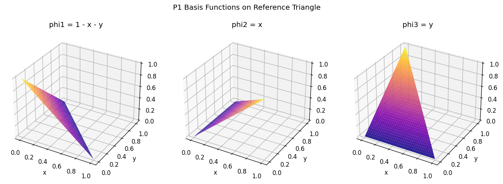
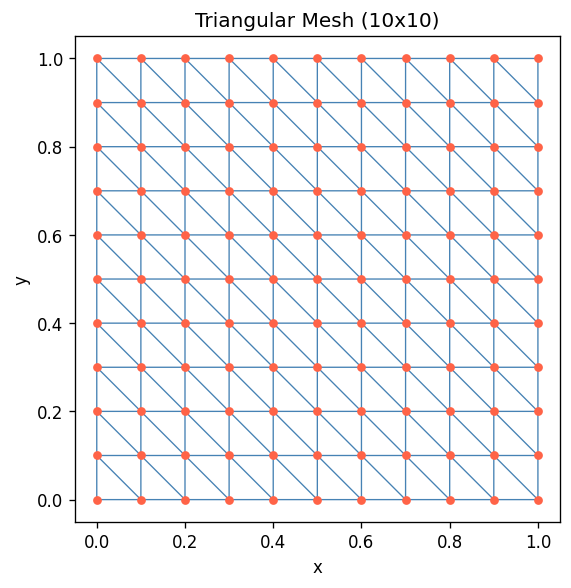
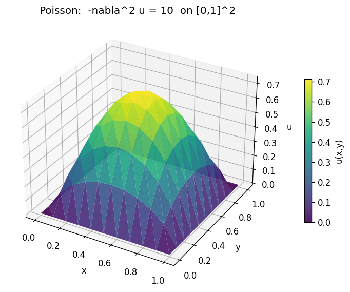
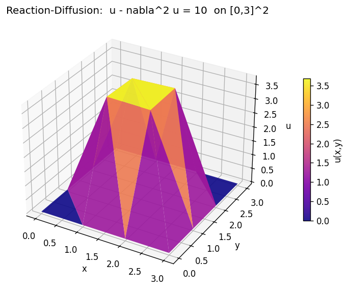
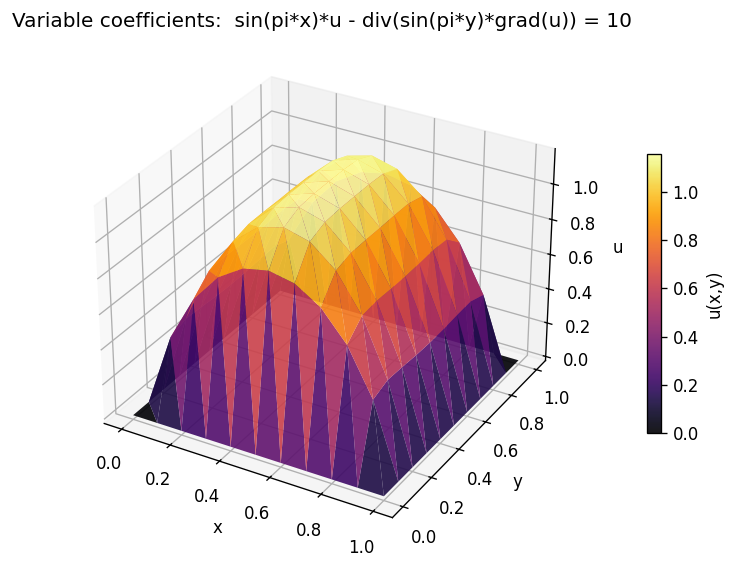

# FEM Solver from Scratch

A 2D Finite Element Method solver built from scratch in Python, covering mesh generation, P1 basis functions, numerical quadrature, and stiffness matrix assembly.

---

## The Problem Being Solved

The solver handles the **reaction-diffusion equation** on a rectangular domain Ω ⊂ ℝ²:

```
a(x,y) · u  −  ∇ · ( b(x,y) · ∇u )  =  f(x,y)    in Ω
u = 0                                            on ∂Ω
```

| Term | Name | Effect |
|---|---|---|
| `a(x,y) · u` | Reaction | Damps the solution; acts like a restoring force |
| `−∇·(b(x,y)·∇u)` | Diffusion (Laplacian) | Spreads values smoothly; penalises sharp gradients |
| `f(x,y)` | Source term | Drives the solution; like a heat source or load |

Special cases:
- **`a = 0`** → pure **Poisson equation** `-∇²u = f` (heat distribution, electrostatics)
- **`a = b = 1`** → **Helmholtz-type** reaction-diffusion
- Spatially varying `a(x,y)`, `b(x,y)` → heterogeneous materials, variable conductivity

---

## Why FEM?

The equation above has no closed-form solution for general domains and coefficients.
FEM converts the PDE into a **finite linear system** that can be solved numerically.

### Step 1: Weak Form

Multiply the PDE by a test function `v` (zero on the boundary) and integrate over Ω.
After integration by parts on the diffusion term:

```
∫_Ω a·u·v dx  +  ∫_Ω b·∇u·∇v dx  =  ∫_Ω f·v dx
```

This is called the **weak form**. It is equivalent to the original PDE for smooth solutions
but holds in a much larger function space (H¹₀(Ω)), allowing piecewise-polynomial approximations.

### Step 2: Discretise with P1 Elements

Divide Ω into triangles (the **mesh**). On each triangle, approximate `u` as a linear
polynomial using **P1 hat basis functions** `φ₁, φ₂, φ₃` defined on the reference triangle:

```
φ₁(x,y) = 1 − x − y       φ₂(x,y) = x       φ₃(x,y) = y
```



Each basis function equals 1 at one vertex and 0 at the others (hence the name **"hat function"**).
The global solution is `u_h = Σⱼ Uⱼ φⱼ`, where `Uⱼ` are the unknown values at mesh nodes.

### Step 3: Assemble the Linear System

Substituting `u_h` and `v = φᵢ` into the weak form and summing over all triangles T:

```
Sᵢⱼ = Σ_T |det J_T| · Σₖ wₖ [ a(xₖ)·φⱼ(xₖ)·φᵢ(xₖ)  +  b(xₖ)·(J_T⁻ᵀ∇φⱼ)·(J_T⁻ᵀ∇φᵢ) ]
lᵢ  = Σ_T |det J_T| · Σₖ wₖ   f(xₖ) · φᵢ(xₖ)
```

where `J_T` is the Jacobian of the affine reference map, and `xₖ, wₖ` are quadrature points/weights.
This builds the **stiffness matrix S** and **load vector l**.

### Step 4: Solve

```
S · U = l    →    U = S⁻¹ · l    (via numpy.linalg.solve)
```

Dirichlet boundary DOFs are pinned to zero before solving.

---

## Results

### Mesh (10×10)
Regular triangular mesh: each rectangular cell is split into 2 triangles.



---

### Poisson Equation: `-∇²u = 10`  on [0,1]²

Zero Dirichlet BCs on all sides. The solution peaks at the centre (~0.73) and smoothly decays to zero at the boundary, analogous to the temperature distribution in a uniformly heated, edge-cooled plate.



---

### Reaction-Diffusion (constant): `u - ∇²u = 10`  on [0,3]²

Adding the reaction term `u` damps the solution relative to pure Poisson, but the larger domain [0,3]² compensates. Solution peaks at ~3.72 near the centre.



---

### Reaction-Diffusion (variable): `sin(πx)·u - ∇·(sin(πy)·∇u) = 10`  on [0,1]²

Spatially-varying coefficients break the symmetry: the reaction coefficient vanishes at `x=0` and `x=1`, while the diffusion coefficient varies in `y`. The solution is no longer symmetric about `x=0.5`.



---

## Code Structure

```
fem_solver/
├── fem/
│   ├── mesh.py        # Structured triangular mesh; affine reference map + Jacobians
│   ├── element.py     # P1 linear basis functions and their gradients
│   ├── quadrature.py  # Gauss/triangle quadrature rules (1D & 2D, up to order 3)
│   └── fespace.py     # FE space: DOF map, stiffness matrix/load vector assembly, solver
└── examples/
    ├── poisson.py
    ├── reaction_diffusion_constant.py
    └── reaction_diffusion_variable.py
```

## Usage

```bash
pip install -r requirements.txt
cd examples
python poisson.py
```

## Dependencies

```
numpy  matplotlib  scipy
```
